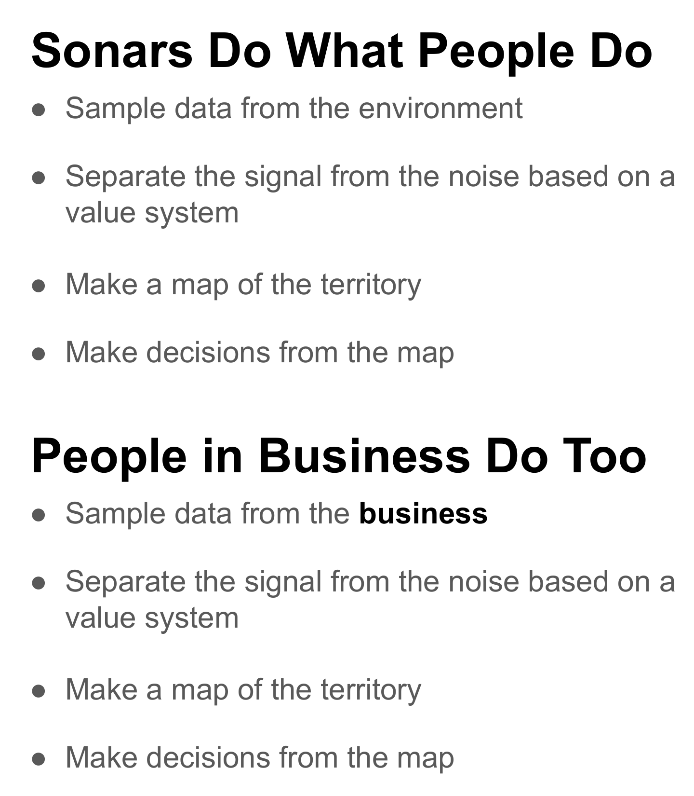
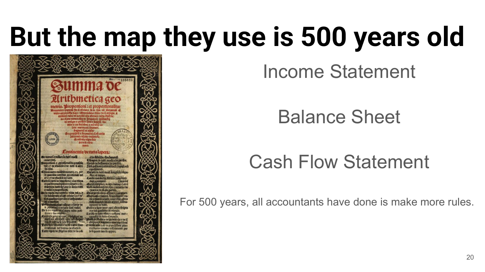
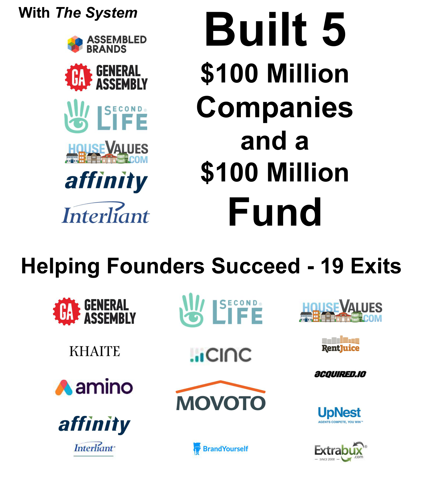
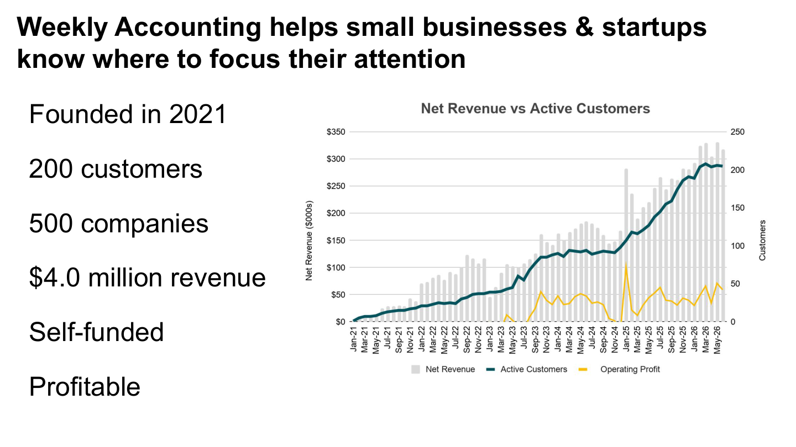

*Part 2 of **Seeing Your Business Better**. [Part 1 — Driving with a Dirty Windshield](/phaedrus/content/seeing-your-business-better/driving-with-a-dirty-windshield/) ended with a promise: I'd tell you why it took an engineer, not an accountant, to find the better way. Here it is.*

<!-- video slot: talk recording, part 2 -->

I invented the Weekly Accounting System, and before you take advice from me about your books, you should know what I am — and what I'm not.

Engineering degrees. Years designing sonar systems. GE's Edison Engineering Program. Harvard Business School. Consulting, investment banking, operating seats inside real companies. A career spent treating information as an instrument — something you build, calibrate, and stake decisions on.

Here's what's not on that list: an accounting license.

I am not an accountant. That's not a confession. It's the point.

## What sonar taught me

A sonar system does four things, in order.

It **samples the environment** — sound in, everything, all the time. It **separates signal from noise** — and it does that using a value system: what matters, what doesn't, what's a whale and what's a submarine. It **makes a map of the territory**. And then a human being **decides from the map**.

That's not a metaphor. That's the actual signal chain, and I spent years inside it. When I got close to businesses — first as a banker, then as an operator — I saw the same chain everywhere. Every operator samples their environment. Every operator separates signal from noise using some value system. Every operator carries a map and makes decisions from it.

Which means the quality of your decisions is capped by the quality of your map.

The question that mattered was the engineer's question: *who built the map, and when was it calibrated?*

## The 500-year-old map

The answer is: a Franciscan friar named Luca Pacioli, in 1494.

Pacioli wrote down double-entry bookkeeping in the *Summa de Arithmetica*, and everything your accountant hands you — income statement, balance sheet, statement of cash flows — descends from that book. It was a masterpiece. It's also five hundred years old, and it was built to answer a merchant's question — *what happened?* — not an operator's question — *what should I do next?*

For five hundred years, all accountants have done is make more rules. The map got more precise, more standardized, more compliant. It did not get more useful for the person driving.

Which brings me to the line I say in every talk. Half the room laughs. The accountants wince — they know it's not an insult; it's a job description:

> **"A CPA is a license to do your books in a way that doesn't help the business."**

Compliance is real work and it has to be done. But compliance is the back window, [as we saw in Part 1](/phaedrus/content/seeing-your-business-better/driving-with-a-dirty-windshield/). Nobody ever steered a car from the back seat.

## The receipts

Fair question: why listen to a sonar guy about accounting?

Because the system works. With The System behind them: five companies past $100M in revenue. A $100M fund. Nineteen exits — General Assembly, Second Life, HouseValues among them.

And because we run our own company on it. Weekly Accounting, founded 2021: 200 customers, 500 companies on the system, $4M in revenue — self-funded and profitable. Our own net-revenue-versus-customers chart hangs where everyone can see it. We practice what we preach, weekly.

## A new map

That's the setup. An engineer looks at accounting and sees a sensor system with a five-hundred-year-old display — enormous signal coming in, a value system tuned for compliance instead of navigation, and operators squinting through the noise.

The fix isn't more reports. The fix is a new map, drawn for the driver.

I built one. Here's what it looks like.

*Next: Part 3 — The Weekly Accounting System.*
