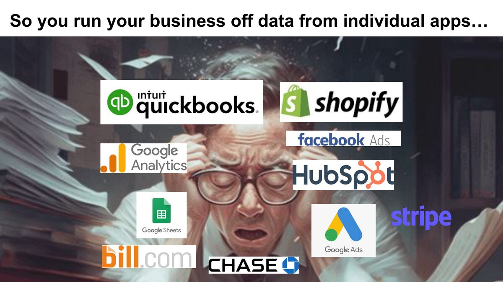
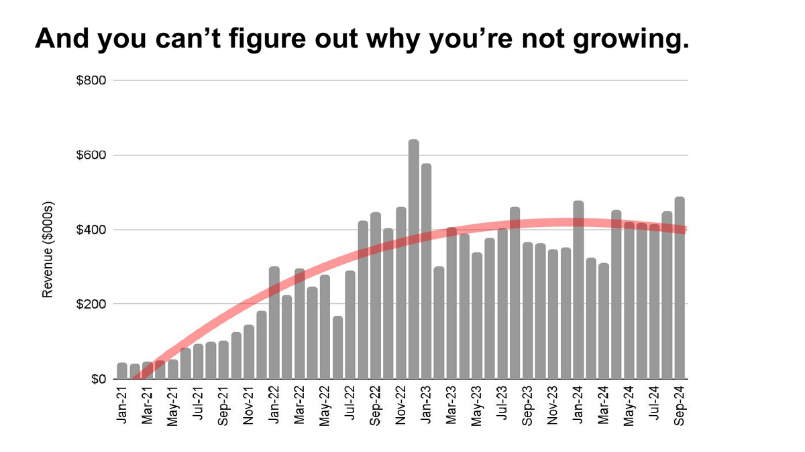
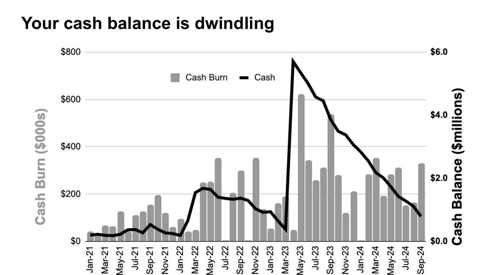

<!-- video slot: talk recording, part 1 -->

I want you to picture the feeling of running your business. Not the org chart version — the Tuesday afternoon version. You're moving fast, decisions are coming at you, and somewhere underneath it all is a question you can't quite answer: *how are we actually doing?*

For most founders I meet, running a business feels like this:

You're driving. The road is right there. But everything is smeared — brake lights, lane lines, the truck merging into you. You squint, you slow down, you guess.

And here's the part that should bother you more than it does: you *have* someone whose whole job is visibility. Your accountant. So where are they?

They're at the back of the bus, carefully polishing the rear window. The books get closed three weeks after the month ends. Immaculate. Reconciled. Compliant. A perfect view of where you've already been — and nothing about the road in front of you. That's not a knock on accountants; it's what the job has been for five hundred years. We'll get to that in [the premise](/wiki/the-premise/).

## So you improvise

With no forward view from the books, you do what every resourceful operator does: you run the business off the apps.

QuickBooks for the books. Shopify for orders. Facebook and Google for ads. HubSpot for the pipeline. Stripe, the bank, and a heroic tangle of spreadsheets holding it all together. Each app is honest about its own little world, and each one shows you a keyhole. Nine keyholes don't make a window. Staring at all of it at once is like trying to read the matrix — columns of green symbols, [no signal](/wiki/signal-vs-noise/).

The result is simple to state and expensive to live:

> **You make decisions with bad information.**

Not because you're careless. Because nothing you look at was built to answer an operator's questions.

## What it costs you

This isn't an abstract problem. It shows up in two charts I see over and over.

Growth flattens, and nobody can say why:

Cash dwindles, even while you're "growing":

And because you can't see *which* dollars are working, the instinct is to push harder on all of them — more ad spend, more hires, more inventory. It feels like this:

Spraying cash out the muffler to make the car go faster. I've watched smart, disciplined founders do this for quarters at a time. The windshield was dirty; the gas pedal still worked.

## There is a better way

Here's the good news: this is a solved problem. Not with more reports — with a different instrument entirely. Clean the windshield once, keep it clean weekly, and the same business that felt like fog starts to feel like a map. That's what the rest of this series is about: the [Fourth Statement](/wiki/fourth-statement/), the [Integrated Financial Model](/wiki/ifm/) behind it, and the weekly rhythm — [Monday Morning Metrics](/wiki/mmm/) — that keeps it alive.

But first you should know why it took an engineer — not an accountant — to build it. That story starts with sonar.

*Next: Part 2 — A Sonar Engineer Looks at Accounting.*
